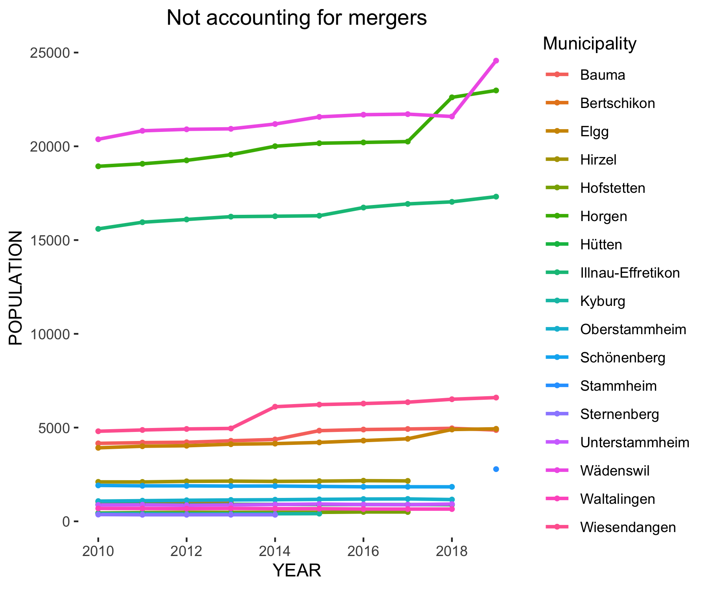
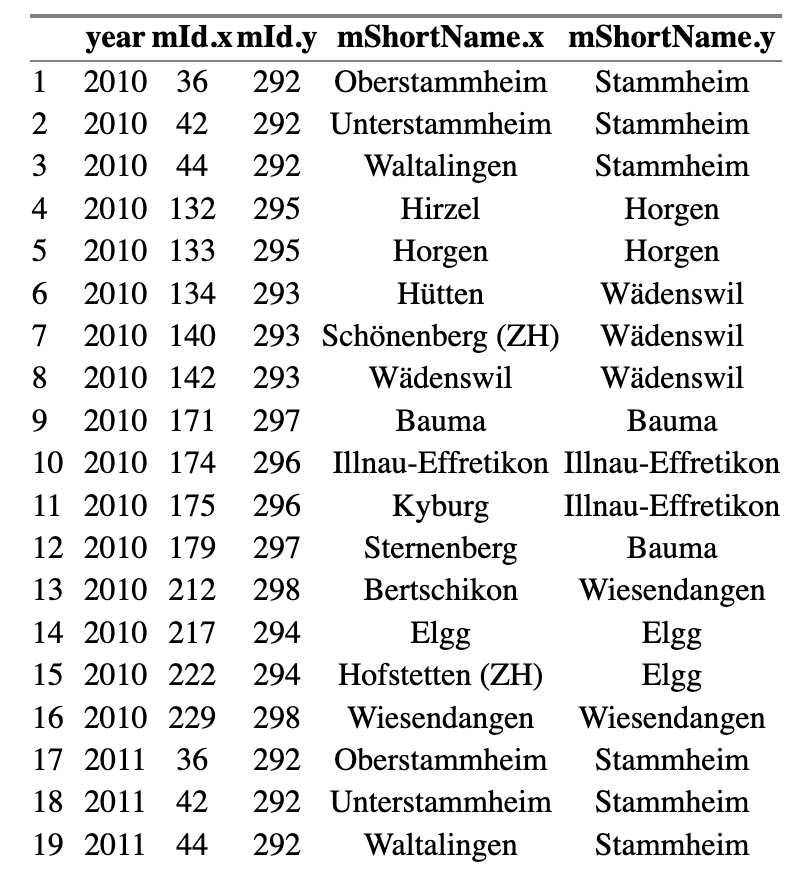

```{r setup, include=FALSE}
options(htmltools.dir.version = FALSE)

library(tidyverse)
library(here)

options(width = 60, tibble.width = 120)
knitr::opts_chunk$set(collapse = TRUE, echo = FALSE, comment = NA)
options(tibble.print_min = 3)
```

# Working with municipality mergers in time series







<br/>
<br/>
<br/>
<br/>
<br/>
<br/>
<br/>

In order to avoid sudden jumps in time series, a lookup table for handling municipality mergers is created that allows for the aggregation to a given municipality state.


